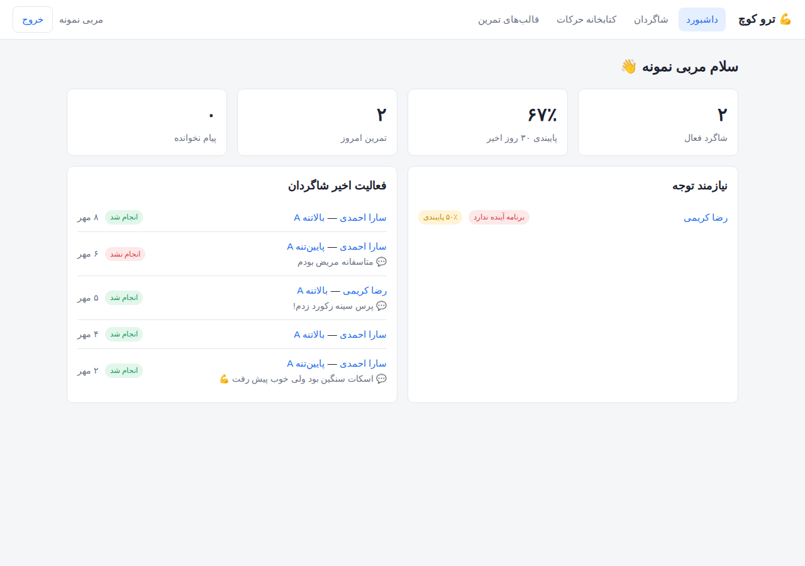
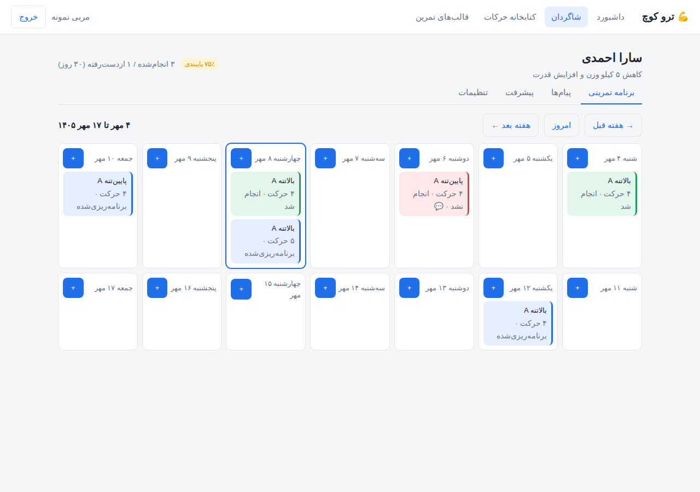
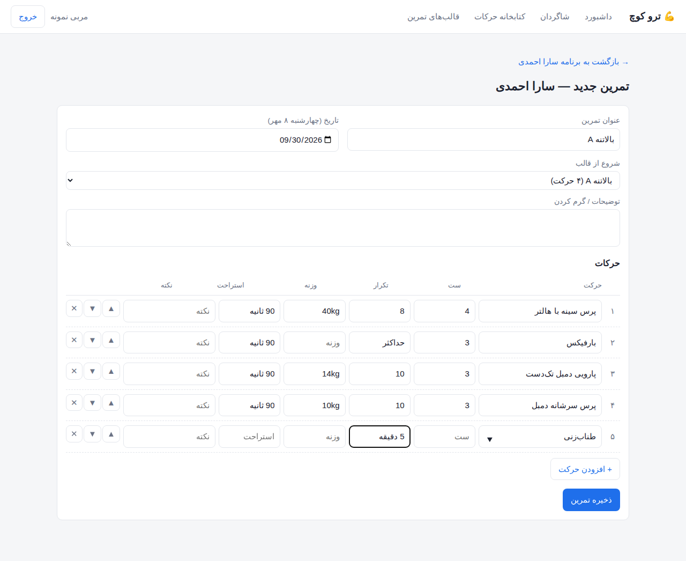
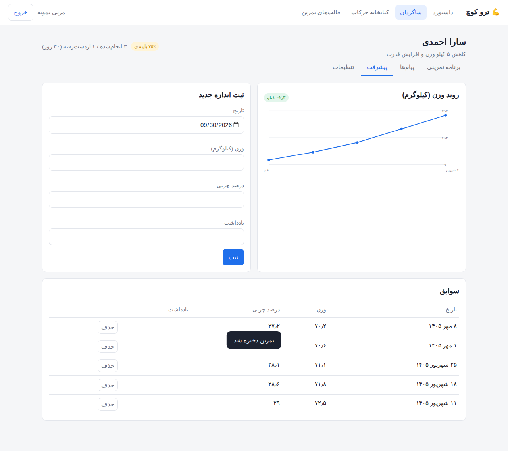
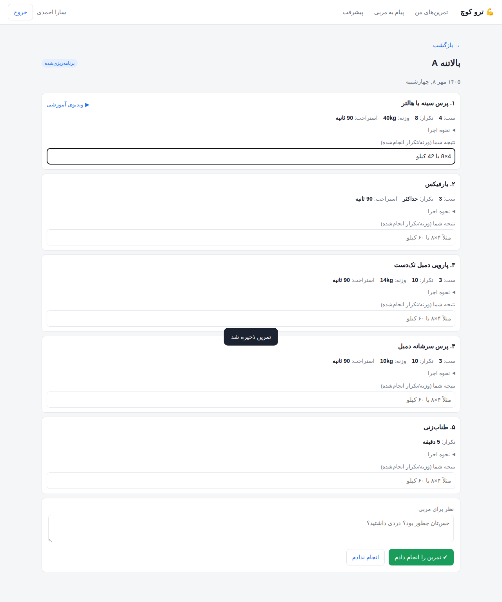
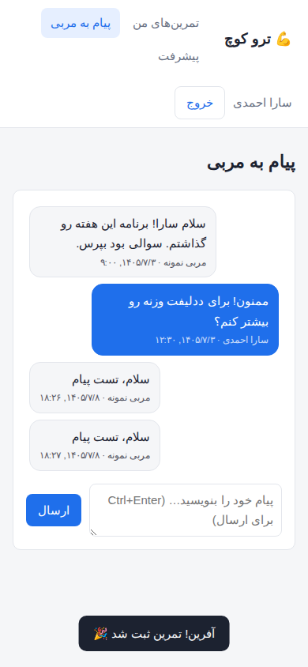

# ترو کوچ (TrueCoach Clone)

پلتفرم مربیگری آنلاین بدنسازی، الهام‌گرفته از قابلیت‌های عمومی [TrueCoach](https://truecoach.co).
این پروژه **از صفر** و بر اساس رفتار و قابلیت‌های قابل مشاهده‌ی محصول ساخته شده است، نه با دیکامپایل یا کپی کد و منابع آن.

## قابلیت‌ها

**پنل مربی**
- داشبورد: تعداد شاگردان، درصد پایبندی ۳۰ روز اخیر، تمرین‌های امروز، پیام‌های نخوانده
- لیست «نیازمند توجه»: شاگردانی که برنامه‌ی آینده ندارند، پایبندی پایین دارند یا پیام نخوانده دارند
- مدیریت شاگردان (افزودن، ویرایش هدف، بایگانی، حذف)
- تقویم دو‌هفته‌ای برنامه‌ی تمرینی هر شاگرد (شنبه تا جمعه، تاریخ شمسی)
- سازنده‌ی تمرین: حرکات با ست/تکرار/وزنه/استراحت/نکته، جابه‌جایی ترتیب، انتخاب از کتابخانه
- کپی تمرین به تاریخ دیگر، ذخیره‌ی تمرین به‌عنوان قالب، اختصاص قالب به هر شاگرد با یک کلیک
- کتابخانه‌ی آماده‌ی ۱۷۶ حرکت در ۱۳ دسته، از جمله ۷ تست و ۳ تست پاک‌سازی FMS با معیار نمره‌دهی و قالب آماده‌ی «ارزیابی FMS» (نام فارسی و انگلیسی، نکات اجرا، لینک ویدیو) با فیلتر دسته و جستجو؛ هر مربی جدید آن را خودکار دریافت می‌کند
- مشاهده‌ی نتایج و نظر ثبت‌شده توسط شاگرد

**اپ شاگرد**
- تمرین‌های امروز/پیش رو/عقب‌افتاده و تاریخچه
- مشاهده‌ی جزئیات هر حرکت + ویدیوی آموزشی، ثبت نتیجه برای هر حرکت و نظر برای مربی
- علامت‌گذاری «انجام دادم» / «انجام ندادم»

**مشترک**
- پیام‌رسانی مربی ↔ شاگرد (با وضعیت خوانده‌شدن)
- ثبت وزن و درصد چربی و نمودار روند وزن

## اجرا

نیازمند Node.js نسخه‌ی ۲۲.۵ یا بالاتر (از `node:sqlite` داخلی استفاده می‌شود). **هیچ وابستگی خارجی ندارد.**

```bash
npm start          # http://localhost:3000
npm test           # تست‌های API
```

در اولین اجرا داده‌ی نمونه ساخته می‌شود:

| نقش  | ایمیل             | رمز       |
|------|-------------------|-----------|
| مربی | `coach@demo.com`  | `demo1234` |
| شاگرد | `client@demo.com` | `demo1234` |

متغیرهای محیطی: `PORT` (پیش‌فرض 3000) و `DB_PATH` (پیش‌فرض `data/truecoach.db`).

## ساختار

```
src/
  server.js   نقطه‌ی شروع HTTP
  app.js      مسیرهای API، کنترل دسترسی، سرو فایل‌های استاتیک
  auth.js     هش رمز (scrypt) و نشست‌های کوکی
  db.js       اسکیمای SQLite
  seed.js     داده‌ی نمونه
public/       فرانت‌اند SPA (JS خالص، راست‌به‌چپ)
test/         تست‌های یکپارچه‌ی API با node:test
```

### API (خلاصه)

| متد | مسیر | توضیح |
|---|---|---|
| POST | `/api/auth/register` · `/login` · `/logout` | احراز هویت (ثبت‌نام فقط برای مربی) |
| GET | `/api/me` · `/api/dashboard` | کاربر فعلی · داشبورد مربی |
| GET/POST/PUT/DELETE | `/api/clients[/:id]` | شاگردان + آمار پایبندی |
| GET/POST/PUT/DELETE | `/api/exercises[/:id]` | کتابخانه‌ی حرکات |
| GET/POST/PUT/DELETE | `/api/workouts[/:id]` | تمرین‌ها (`?client_id&from&to`) |
| POST | `/api/workouts/:id/copy` · `/log` · `/save-template` | کپی · ثبت نتیجه · ذخیره به‌عنوان قالب |
| GET/POST/PUT/DELETE | `/api/templates[/:id]` · POST `/:id/assign` | قالب‌ها |
| GET/POST | `/api/messages` | پیام‌ها |
| GET/POST/DELETE | `/api/metrics[/:id]` | اندازه‌های بدن |

## قدم‌های بعدی پیشنهادی
- برنامه‌های چندهفته‌ای (Program) و اختصاص یکجا
- اعلان (ایمیل/پوش) برای تمرین جدید و پیام
- آپلود ویدیوی فرم اجرای شاگرد
- پرداخت و اشتراک ماهانه‌ی شاگردان
- اپ موبایل (React Native / PWA)

## تصاویر

| داشبورد مربی | تقویم شاگرد | سازنده‌ی تمرین |
|---|---|---|
|  |  |  |

| پیشرفت | ثبت تمرین توسط شاگرد | پیام‌ها (موبایل) |
|---|---|---|
|  |  |  |
